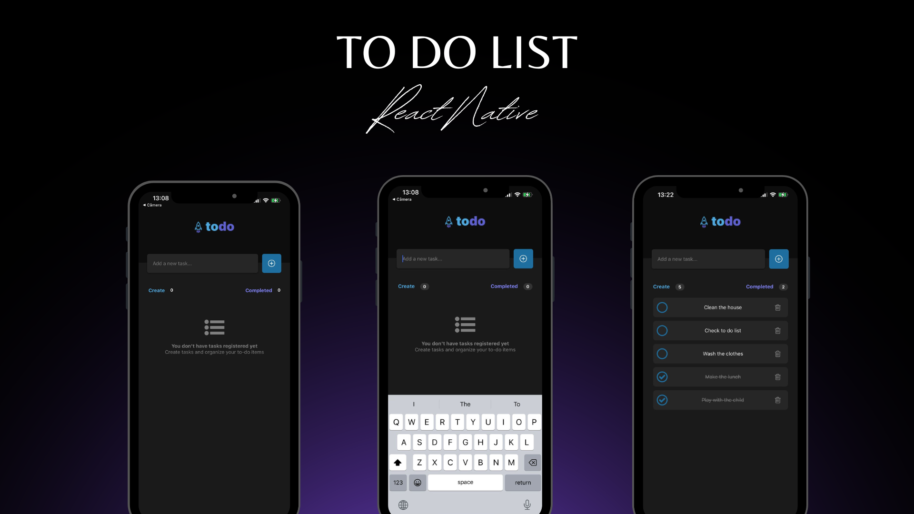

<p align="center">
  
  
  
</p>
<p align="center">
    
</p>


<br>
<br>

## 🧪 Technologies

This project was developed using the following technologies:

- [TypeScript](https://www.typescriptlang.org/)
- [ReactJS](https://reactjs.org/)
- [React Native](https://reactnative.dev/)
- [Expo](https://expo.io/)


## 🚀 Getting started
Clone the project and access the folder.

```bash
$ git clone https://github.com/weslleyolli/To_Do_List_React_Native
$ cd To_Do_List_React_Native
```

Follow the steps below:

### Mobile

```bash
# Install the web dependencies
$ cd To_Do_List_React_Native
$ npm install

# Start the web project
$ npx start expo

# Download the expo go in your cellphone
```


Made with 💜 by [Weslleyolli](https://github.com/weslleyolli)👋
